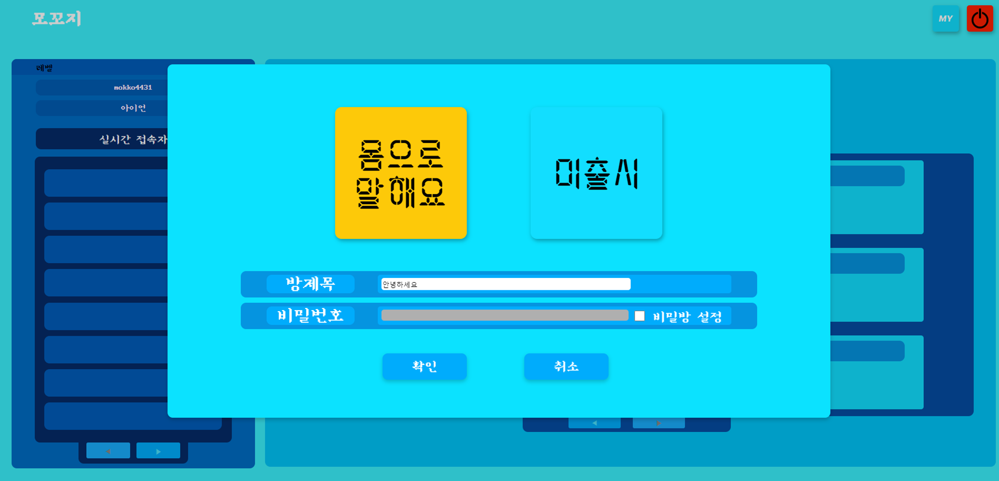
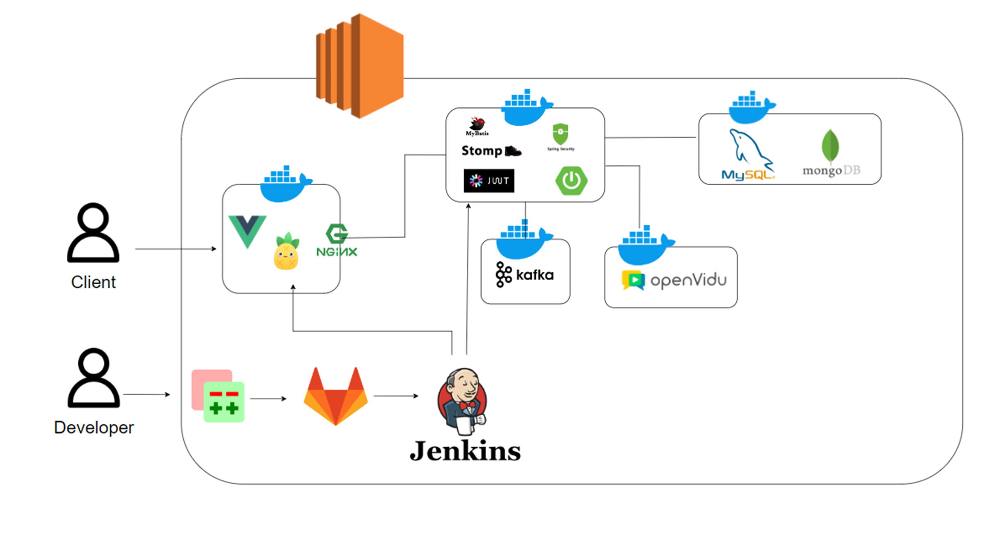
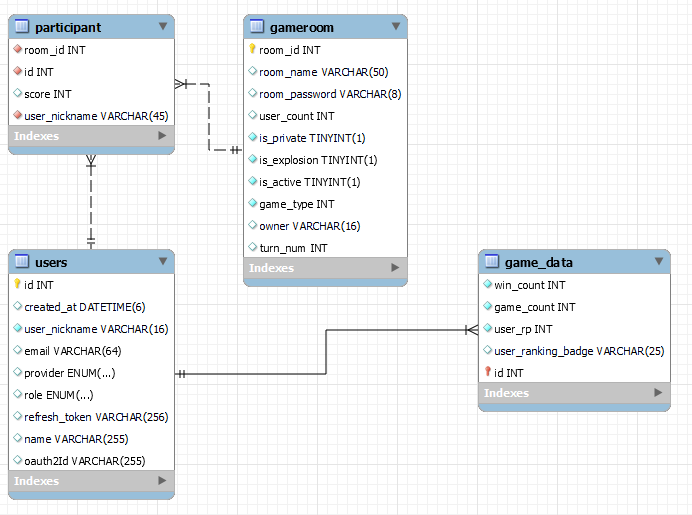

모꼬지
============================
[프로젝트 소개](#프로젝트-소개)
[Abstract](#Abstract)
[개발 환경](#개발-환경)
[주요 기능 소개](#주요-기능-소개)
[기대 효과](#기대-효과)
[서비스 화면](#서비스-화면)
[기술 소개](#기술-소개)
[시스템 아키텍처](#시스템-아키텍처)
[ERD](#erd)
[산출물](#산출물)
[E2E 테스트](#e2e-테스트)
[협업](#협업)
[팀 소개](#팀-소개)


## 프로젝트 소개

> **회사 동료와 친하면 친할수록
일의 성과는 더 커진다.**
-인적관리 전문가 론 프리드먼 -

업무 성과를 높이기 위해 동료 간의 친밀도를 강화하고자 하는 목표를 달성하기 위해 개발된 온라인 화상채팅 게임 모꼬지 입니다.

## Abstract

> **The closer you are to a co-worker, the more intimate you are
The results of the work are greater**
-Ron Friedman -

Mokkoji, an online video chat game developed to achieve the goal of enhancing intimacy among colleagues to improve work performance.

## 개발 환경
IntelliJ 2023.3.2

 Springboot: 3.2.2

 VS Code: 1.85.1
 Vue3 3.4.15

 Vite: 5.0.10

 Node.js: 20.10.0

 JVM: 17.0.9

 SERVER: AWS EC2 Ubuntu 20.04.6 LTS
 
 MySQL: 8.0.34

## 주요 기능 소개
1. WebRTC를 통한 생생한 게임서비스
2. 별도로 회원가입 하지않아도 게임 가능
3. 멀티룸 구조를 활용한 게임 대기방 목록
- 게임방 생성
- 아직 게임을 시작하지 않은 게임방들 조회
4. 게임방
- 비밀방 생성을 통해 친구끼리 게임 가능
- 대기방을 통해 다양한 사람들과 게임 가능
5. 게임 - 몸으로 말해요
- 게임 전에는 자유롭게 
- 참여자 중 랜덤으로 한 명을 지정해 제시어를 제공
- 지정된 사람은 입에 필터가 씌워진 채로 제시어를 몸으로 표현
- 나머지 참여자들은 채팅을 통해 제시어를 맞힘
6. 관리자
- 게임 제시어 추가

## 기대효과
* 게임을 준비하기 위한 사전 준비가 필요없음
* 다양한 사람들과의 게임을 통한 소통 가능
* 비밀방 시스템을 통한 팀원들간의 친목 도모 가능

## 서비스 화면
* 로그인 화면


* 비회원 입장


* 방/비밀방 생성


* 게임 방(방장만 시작 버튼을 누를 수 있다.)


* 게임 진행 (3명 이상 6명 이하까지 가능하다.)


* 게임 끝


## 기술 소개
1. OpenVidu를 활용하여 화상기능 구현
2. 멀티룸 구조를 활용한 게임 대기방 시스템
3. STOMP와 Sockjs를 활용한 채팅 가능
4. Kafka를 활용한 효율적인 채팅 데이터 처리

## 시스템 아키텍처


## ERD


## 산출물
👉🏻[산출물 링크](./exec/B304%20최종%20산출물.pdf)

## E2E 테스트
Cypress 사용


## 협업
Gerrit


Jira
;

MatterMost, Gitlab

## 팀 소개

### 이예진
```
🎓 1036707
✉️  bella_floret@naver.com
💟 #팀장 #BE #PPT #발표
```

### 김현진
```
🎓 1039202
✉️ tcmhdn77@naver.com
💟 #BE #Jira #UCC
```

### 이대영
```
🎓 1036748
✉️ kmdy7991@naver.com
💟 #BE #WebRTC #Stomp
```


### 정종욱
```
🎓 1030262
✉️ cnhug3@naver.com
💟 #FE
```


### 조성주
```
🎓 1035808
✉️ chosj33@naver.com
💟 #FE #UCC
```

